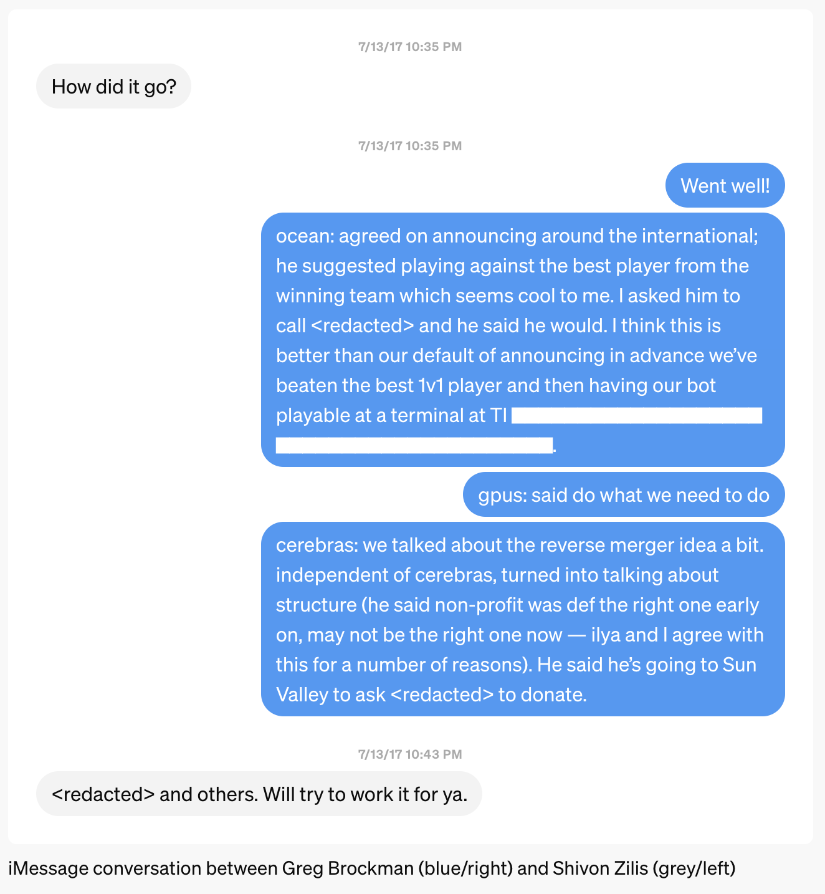

Last post: 7/11-elon.md

Elon Musk wanted an OpenAI for-profit
source: https://openai.com/index/elon-musk-wanted-an-openai-for-profit

## Timeline of events
1. November 2015: OpenAI started as a nonprofit, which Elon questioned
1. December 2015: OpenAI publicly announced
1. Early 2017: Our research progress led us to realize we would need billions 1. of dollars for the compute to build AGI
1. Summer 2017: We and Elon agreed that a for-profit was the next step for 1. OpenAI to advance the mission
1. Fall 2017: Elon demanded majority equity, absolute control, and to be CEO 1. of the for-profit
1. September 2017: Elon created the public benefit corporation called “Open 1. Artificial Intelligence Technologies, Inc.”
1. September 2017: We rejected Elon's terms because giving him unilateral 1. control of OpenAI and its technology would be contrary to the mission
1. January 2018: Elon said OpenAI was on a path for certain failure unless we 1. merged into Tesla.
1. February 2018: Elon resigned as co-chair of OpenAI
1. December 2018: Elon told us to raise “billions per year immediately or 1. forget it”
1. March 2019: We announced the capped-profit OpenAI LP, within the non-profit
1. March 2023: Elon started his OpenAI competitor, xAI

Elon Musk’s latest legal filing against OpenAI marks his fourth attempt in less than a year to reframe his claims. However, his own words and actions speak for themselves—in 2017, Elon not only wanted, but actually created, a for-profit as OpenAI’s proposed new structure. When he didn’t get majority equity and full control, he walked away and told us we would fail. Now that OpenAI is the leading AI research lab and Elon runs a competing AI company, he’s asking the court to stop us from effectively pursuing our mission.

You can’t sue your way to AGI. We have great respect for Elon’s accomplishments and gratitude for his early contributions to OpenAI, but he should be competing in the marketplace rather than the courtroom. It is critical for the U.S. to remain the global leader in AI. Our mission is to ensure AGI benefits all of humanity, and we have been and will remain a mission-driven organization. We hope Elon shares that goal, and will uphold the values of innovation and free market competition that have driven his own success.

November 2015: OpenAI started as a nonprofit, which Elon questioned
On November 20, 2015, Elon said: “Also, the structure doesn't seem optimal…. Probably better to have a standard C corp with a parallel nonprofit.” We felt a nonprofit was the right path at the time, but later came to realize that our structure would have to evolve to attract the capital necessary for the mission.

===
Re: AI docs
––––– Forwarded message –––––
From: Elon Musk <redacted>
Date: Fri, Nov 20, 2015 at 12:29 PM
To: Sam Altman <redacted>
I think this should be independent from (but supported by) YC, not what sounds like a subsidiary.

Also, the structure doesn’t seem optimal. In particular, the YC stock along with a salary from the nonprofit muddies the alignment of incentives. Probably better to have a standard C corp with a parallel nonprofit.

On Nov 20, 2015, at 11:48 AM, Sam Altman <redacted> wrote:

Elon–

Plan is to have you, me, and Ilya on the Board of Directors for YC AI, which will be a Delaware non-profit. We will also state that we plan to elect two other outsiders by majority vote of the Board.

We will write into the bylaws that any technology that potentially compromises the safety of humanity has to get consent of the Board to be released, and we will reference this in the researchers’ employment contracts.

At a high level, does that work for you?

I’m cc’ing our GC <redacted> here–is there someone in your office he can work with on the details?

Sam
===

December 2015: OpenAI publicly announced
OpenAI was introduced to the world.

Early 2017: Our research progress led us to realize we would need billions of dollars for the compute to build AGI.
In 2017, we made progress on building an AI for the competitive video game, Dota⁠. We discovered we would need far more compute than we initially imagined.

On June 13, 2017, Elon responded to an email, saying, “Ok. Let’s figure out the least expensive way to ensure compute power is not a constraint…”

Ilya reiterated on July 12, 2017, “Each year, we'll need to exponentially increase our hardware spend, but we have reason to believe AGI can ultimately be built with less than $10B in hardware.”

===
Re: Followup thoughts
From: Elon Musk <redacted>
Date: Fri, Feb 19, 2016 at 12:05 AM
To: Ilya Sutskever <redacted>
Cc: Greg Brockman <redacted>, Sam Altman <redacted>
Frankly, what surprises me is that the AI community is taking this long to figure out concepts. It doesn’t sound super hard. High-level linking of a large number of deep nets sounds like the right approach or at least a key part of the right approach. ███████████████████████████████

The probability of DeepMind creating a deep mind increases every year. Maybe it doesn’t get past 50% in 2 to 3 years, but it likely moves past 10%. That doesn’t sound crazy to me, given their resources.

In any event, I have found that it is far better to overestimate than underestimate competitors.

This doesn’t mean we should rush out and hire weak talent. I agree that nothing good would be achieved by that. What we need to do is redouble our efforts to seek out the best people in the world, do whatever it takes to bring them on board and imbue the company with a high sense of urgency.

It will be important for OpenAI to achieve something significant in the next 6 to 9 months to show that we are for real. Doesn’t need to be a whopper breakthrough, but it should be enough for key talent around the world to sit up and take notice.

From: Ilya Sutskever <redacted>
Date: Fri, Feb 19, 2016, at 10:28 AM
To: Elon Musk <redacted>
Cc: Greg Brockman <redacted>, Sam Altman <redacted>
Several points:

1. It is not the case that once we solve “concepts,” we get AI. Other problems that will have to be solved include unsupervised learning, transfer learning, and lifetime learning. We’re also doing pretty badly with language right now. It does not mean that these problems will not see significant progress in the coming years, but it is not the case that there is only one problem that stands between us and full human level AI.
1. We can’t build AI today because we lack key ideas (computers may be too slow, too, but we can’t tell). Powerful ideas are produced by top people. Massive clusters help, and are very worth getting, but they play a less important role.
1. We will be able to achieve a conventionally significant result in the next 6 to 9 months, simply because the people we already have are very good. Achieving a field-altering result will be harder, riskier, and take longer. But we have a not unreasonable plan for that as well.

### Bi-weekly updates
3 emails
From: Ilya Sutskever <redacted>
Date: Mon, Jun 12, 2017 at 10:39 PM
To: Greg Brockman <redacted>, <redacted>, Elon Musk <redacted>

This is the first of our bi-weekly updates. The goal is to keep you up to date, and to help us make greater use from your visits.

Compute:

1. Compute is used in two ways: it is used to run a big experiment quickly, and it is used to run many experiments in parallel.
1. 95% of progress comes from the ability to run big experiments quickly. The utility of running many experiments is much less useful.
1. In the old days, a large cluster could help you run more experiments, but it could not help with running a single large experiment quickly.
For this reason, an academic lab could compete with Google, because Google’s only advantage was the ability to run many experiments. This is not a great advantage.
1. Recently, it has become possible to combine 100s of GPUs and 100s of CPUs to run an experiment that’s 100x bigger than what is possible on a single machine while requiring comparable time. This has become possible due to the work of many different groups. As a result, the minimum necessary cluster for being competitive is now 10–100x larger than it was before.
1. Currently, every Dota experiment uses 1000+ cores, and it is only for the small 1v1 variant, and on extremely small neural network policies. We will need more compute to just win the 1v1 variant. To win the full 5v5 game, we will need to run fewer experiments, where each experiment is at least 1 order of magnitude larger (possibly more!).
1. **TLDR:** What matters is the size and speed of our experiments. In the old days, a big cluster could not let anyone run a larger experiment quickly. Today, a big cluster lets us run a large experiment 100x faster.
1. In order to be capable of accomplishing our projects even in theory, we need to increase the number of our GPUs by a factor of 10x in the next 1–2 months (we have enough CPUs). We will discuss the specifics in our in-person meeting.

#### Dota 2:
1. We will solve the 1v1 version of the game in 1 month. Fans of the game care about 1v1 a fair bit.
1. We are now at a point where a **single experiment** consumes 1000s of cores, and where adding more distributed compute increases performance.
Here is a cool video of our bot doing something rather clever: https://www.youtube.com/watch?v=Y-vxbREX5ck&feature=youtu.be&t=99.

#### Rapid learning of new games:

1. Infra work is underway
1. We implemented several baselines
1. Fundamentally, we’re not where we want to be, and are taking action to correct this.

#### Robotics:

1. Current status: The HER algorithm (https://www.youtube.com/watch?v=Dz_HuzgMzxo) can learn to solve many low-dimensional robotics tasks that were previously unsolvable very rapidly. It is non-obvious, simple, and effective.
1. **In 6 months, we will accomplish at least one of**: single-handed Rubik’s cube, pen spinning (https://www.youtube.com/watch?v=dDavyRnEPrI), Chinese balls spinning (https://www.youtube.com/watch?v=M9N1duIl4Fc) using the HER algorithm and using a sim2real method [such as https://blog.openai.com/spam-detection-in-the-physical-world/].
1. The above will be deployed on the robotic hand: [Link to Google Drive] [this video is human controlled, not algorithmic controlled. Need to be logged in to the OpenAI account to see the video].

#### Self play as a key path to AGI:

1. Self play in multiagent environments is magical: if you place agents into an environment, then no matter how smart (or not smart) they are, the environment will provide them with the exact level of challenge, which can be faced only by outsmarting the competition. So for example, if you have a group of children, they will find each other’s company to be challenging; likewise for a collection of super intelligences of comparable intelligence. So the “solution” to self-play is to become more and more intelligent, without bound.
1. Self-play lets us get “something out of nothing.” The rules of a competitive game can be simple, but the best strategy for playing this game can be immensely complex. [motivating example: https://www.youtube.com/watch?v=u2T77mQmJYI].
1. Training agents in simulation to develop very good dexterity via competitive fighting, such as wrestling. Here is a video of ant-shaped robots that we trained to struggle: <redacted>
1. Current work on self-play: getting agents to learn to develop a language [gifs in https://blog.openai.com/learning-to-cooperate-compete-and-communicate/].Agents are doing “stuff,” but it’s still work in progress.

We have a few more cool smaller projects. Updates to be presented as they produce significant results.
===
From: Elon Musk <redacted>
Date: Mon, Jun 12, 2017 at 10:52 PM
To: Ilya Sutskever <redacted>
Cc: Greg Brockman <redacted>, <redacted>
Thanks, this is a great update.

From: Elon Musk <redacted>
Date: Tue, Jun 13, 2017 at 10:24 AM
To: Ilya Sutskever <redacted>
Cc: Greg Brockman <redacted>, <redacted>
Ok. Let’s figure out the least expensive way to ensure compute power is not a constraint…
===
The business of building AGI
From: Ilya Sutskever <redacted>
Date: Wed, Jul 12, 2017 at 1:36 PM
To: Elon Musk <redacted>, Greg Brockman <redacted>

We usually decide that problems are hard because smart people have worked on them unsuccessfully for a long time. It’s easy to think that this is true about AI. However, the past five years of progress have shown that the earliest and simplest ideas about AI — neural networks — were right all along, and we needed modern hardware to get them working.

Historically, AI breakthroughs have consistently happened with models that take between 7–10 days to train. This means that hardware defines the surface of potential AI breakthroughs. This is a statement about human psychology more than about AI. If experiments take longer than this, it’s hard to keep all the state in your head and iterate and improve. If experiments are shorter, you’ll just use a bigger model.

It’s not so much that AI progress is a hardware game, any more than physics is a particle accelerator game. But if our computers are too slow, no amount of cleverness will result in AGI, just like if a particle accelerator is too small, we have no shot at figuring out how the universe works. Fast enough computers are a necessary ingredient, and all past failures may have been caused by computers being too slow for AGI.

Until very recently, there was no way to use many GPUs together to run faster experiments, so academia had the same “effective compute” as industry. But earlier this year, Google used two orders of magnitude more compute than is typical to optimize the architecture of a classifier, something that usually requires lots of researcher time. And a few months ago, Facebook released a paper showing how to train a large ImageNet model with near-linear speedup to 256 GPUs (given a specially-configured cluster with high-bandwidth interconnects).

Over the past year, Google Brain produced impressive results because they have an order of magnitude or two more GPUs than anyone. We estimate that Brain has around 100k GPUs, FAIR has around 15–20k, and DeepMind allocates 50 per researcher on question asking, and rented 5k GPUs from Brain for AlphaGo. Apparently, when people run neural networks at Google Brain, it eats up everyone’s quotas at DeepMind.

We're still missing several key ideas necessary for building AGI. How can we use a system's understanding of “thing A” to learn “thing B” (e.g. can I teach a system to count, then to multiply, then to solve word problems)? How do we build curious systems? How do we train a system to discover the deep underlying causes of all types of phenomena — to act as a scientist? How can we build a system that adapts to new situations on which it hasn’t been trained on precisely (e.g. being asked to apply familiar concepts in an unfamiliar situation)? But given enough hardware to run the relevant experiments in 7–10 days, history indicates that the right algorithms will be found, just like physicists would quickly figure out how the universe works if only they had a big enough particle accelerator.

There is good reason to believe that deep learning hardware will speed up 10x each year for the next four to five years. The world is used to the comparatively leisurely pace of Moore’s Law, and is not prepared for the drastic changes in capability this hardware acceleration will bring. This speedup will happen not because of smaller transistors or faster clock cycles; it will happen because like the brain, neural networks are intrinsically parallelizable, and new highly parallel hardware is being built to exploit this.

Within the next three years, robotics should be completely solved, AI should solve a long-standing unproven theorem, programming competitions should be won consistently by AIs, and there should be convincing chatbots (though no one should pass the Turing test). In as little as four years, each overnight experiment will feasibly use so much compute capacity that there’s an actual chance of waking up to AGI, given the right algorithm — and figuring out the algorithm will actually happen within 2–4 further years of experimenting with this compute in a competitive multiagent simulation.

**To be in the business of building safe AGI, OpenAI needs to**:

1. Have the best AI results each year. In particular, as hardware gets exponentially better, we’ll have dramatically better results. Our DOTA and Rubik’s cube projects will have impressive results for the current level of compute. Next year’s projects will be even more extreme, and what’s realistic depends primarily on what compute we can access.
1. Increase our GPU cluster from 600 GPUs to 5000 GPUs ASAP. As an upper bound, this will require a capex of $12M and an opex of $5–6M over the next year. Each year, we’ll need to exponentially increase our hardware spend, but we have reason to believe AGI can ultimately be built with less than $10B in hardware.
1. Increase our headcount: from 55 (July 2017) to 80 (January 2018) to 120 (January 2019) to 200 (January 2020). We’ve learned how to organize our current team, and we’re now bottlenecked by number of smart people trying out ideas.
1. Lock down an overwhelming hardware advantage. The 4-chip card that <redacted> says he can build in 2 years is effectively TPU 3.0 and (given enough quantity) would allow us to be on an almost equal footing with Google on compute. The Cerebras design is far ahead of both of these, and if they’re real then having exclusive access to them would put us far ahead of the competition. We have a structural idea for how to do this given more due diligence, best to discuss on a call.

2/3/4 will ultimately require large amounts of capital. If we can secure the funding, we have a real chance at setting the initial conditions under which AGI is born. Increased funding needs will come lockstep with increased magnitude of results. We should discuss options to obtain the relevant funding, as that’s the biggest piece that’s outside of our direct control.

**Progress this week:**

1. We’ve beat our top 1v1 test player (he’s top 30 in North America at 1v1, and beats the top 1v1 player about 30% of the time), but the bot can also be exploited by playing weirdly. We’re working on understanding these exploits and cracking down on them.
- Repeated from Saturday, here’s the first match where we beat our top test player: https://www.youtube.com/watch?v=FBoUHay7XBI&feature=youtu.be&t=345
- Every additional day of training makes the bot stronger and harder to exploit.
1. Robot getting closer to solving Rubik’s cube.
- The improved cube simulation teleoperated by a human: <redacted>.
1. Our defense against adversarial examples is starting to work on ImageNet.
  1. We will completely solve the problem of adversarial examples by the end of August.

## Summer 2017: We and Elon agreed that a for-profit was the next step for OpenAI to advance the mission

On July 13th, 2017, Greg sent Shivon Zilis, who was operating as a liaison between Elon and OpenAI, recap notes from a meeting with Elon that day where we proposed an idea to merge with a hardware startup, saying it “turned into talking about structure (he said non-profit was def the right one early on, may not be the right one now — ilya and I agree with this for a number of reasons).”

On July 21st, 2017, Elon forwarded an article about China’s plan to match the U.S. in AI research facilities by 2020 and become the world leader in AI by 2030 in order to support agriculture and manufacturing as well as homeland security and surveillance efforts. Elon said, “They will do whatever it takes to obtain what we develop. Maybe another reason to change course.”

Greg agreed, saying that starting 2018 the path would need to be a “AI research + hardware for-profit”. Elon responded, “Let's talk Sat or Sun. I have a tentative game plan that I'd like to run by you.”
===
Beijing Wants A.I. to Be Made in China by 2030 - NYTimes.com
From: Elon Musk <redacted>
Date: Fri, Jul 21, 2017 at 3:34 AM
To: Greg Brockman <redacted>, Ilya Sutskever <redacted>
They will do whatever it takes to obtain what we develop. Maybe another reason to change course.

[Link to news article]

From: Greg Brockman <redacted>
Date: Fri, Jul 21, 2017 at 1:18 PM
To: Elon Musk <redacted>
Cc: Ilya Sutskever <redacted>
100% agreed. We think the path must be:

AI research non-profit (through end of 2017)
AI research + hardware for-profit (starting 2018)
Government project (when: ??)
█████████████████████████████████████████████████████████████████████████████████████████████████████████████████████████████████████████████████████████████████████████████████

-gdb

From: Elon Musk <redacted>
Date: Fri, Jul 21, 2017 at 1:18 PM
To: Greg Brockman <redacted>
Cc: Ilya Sutskever <redacted>, <redacted>
Let’s talk Sat or Sun. I have a tentative game plan that I’d like to run by you.
===

On August 11, 2017, our AI beat the world’s best players at Dota 1v1. That night, Elon told us “Time to make the next step for OpenAI. This is the triggering event.”
===
Tomorrow afternoon
From: Elon Musk <redacted>
Date: Fri, Aug 11, 2017 at 9:17 PM
To: Greg Brockman <redacted>, Ilya Sutskever <redacted>, Sam Altman <redacted>
Cc: <redacted>, Shivon Zilis <redacted>
████████████████████████████████ Are you guys able to meet or do a conf call tomorrow afternoon?

Time to make the next step for OpenAI. This is the triggering event.
===
### Fall 2017: Elon demanded majority equity, absolute control, and to be CEO of the for-profit.

Over the next six weeks, we negotiated terms for the for-profit.

Elon demanded majority equity. On September 4, 2017, Shivon wrote in a message to Greg, “And he sounded fairly non-negotiable on his equity being between 50-60 so moot point on having majority”. On one call, Elon told us he didn’t care about equity personally but just needed to accumulate $80B for a city on Mars.

On September 12, 2017, Elon laid out a board structure where he would “unequivocally have initial control of the company”.
===
Re: Current State
From: Elon Musk <redacted>
Date: Wed, Sep 13, 2017 at 12:40 AM
To: Ilya Sutskever <redacted>
Cc: Greg Brockman <redacted>
Sounds good. The three common stock seats (you, Greg and Sam) should be elected by common shareholders. They will de facto be yours, but not in the unlikely event that you lose the faith of a huge percentage of common stockholders over time or step away from the company by choice.

I think that the Preferred A investment round (supermajority me) should have the right to appoint four (not three) seats. I would not expect to appoint them immediately, but, like I said I would unequivocally have initial control of the company, but this will change quickly.

The rough target would be to get to a 12 person board (probably more like 16 if this board really ends up deciding the fate of the world) where each board member has a deep understanding of technology, at least a basic understanding of AI and strong & sensible morals.

Apart from the Series A four and the Common three, there would likely be a board member with each new lead investor/ally. However, the specific individual new board members can only be added if all but one existing board member agrees. Same for removing board members.

There will also be independent board members we want to add who aren’t associated with an investor. Same rules apply: requires all but one of existing directors to add or remove.

I’m super tired and don’t want to overcomplicate things, but this seems approx right. At the sixteen person board level, we would have 7/16 votes and I’d have a 25% influence, which is my min comfort level. That sounds about right to me. If everyone else we asked to join our board is truly against us, we should probably lose.

As mentioned, my experience with boards (assuming they consist of good, smart people) is that they are rational and reasonable. There is basically never a real hardcore battle where an individual board vote is pivotal, so this is almost certainly (sure hope so) going to be a moot point.

As a closing note, I’ve been really impressed with the quality of discussion with you guys on the equity and board stuff. I have a really good feeling about this.

Lmk if above seems reasonable.

Elon
===
Elon also told us he would need to be CEO.

## September 2017: Elon created the public benefit corporation called “Open Artificial Intelligence Technologies, Inc.”

Elon directed Jared Birchall, his wealth manager, to create the public benefit corporation “Open Artificial Intelligence Technologies, Inc” (akin to SpaceX’s official name of “Space Exploration Technologies Corporation”). It was registered on on September 15, 2017:

## September 2017: We rejected Elon's terms because giving him unilateral control of OpenAI and its technology would be contrary to the mission.

We came close to accepting Elon’s terms. As we told him, “We really want to work with you. We believe that if we join forces, our chance of success in the mission is the greatest.”

However, we felt his proposal was not compatible with the mission, saying: “The current structure provides you with a path where you end up with unilateral absolute control over the AGI. You stated that you don't want to control the final AGI, but during this negotiation, you've shown to us that absolute control is extremely important to you.” As we told Elon, “The goal of OpenAI is to make the future good and to avoid an AGI dictatorship.”

We concluded, “Thus we are concerned that as the company makes genuine progress towards AGI, you will choose to retain your absolute control of the company despite current intent to the contrary.”
===
Honest Thoughts
4 emails
From: Ilya Sutskever <redacted>
Date: Wed, Sep 20, 2017 at 2:08 PM
To: Elon Musk <redacted>, Sam Altman <redacted>, Greg Brockman <redacted>
Elon, Sam,

This process has been the highest stakes conversation that Greg and I have ever participated in, and if the project succeeds, it’ll turn out to have been the highest stakes conversation the world has seen. It’s also been a deeply personal conversation for all of us.

Yesterday while we were considering making our final commitment (even the non-solicit agreement), we realized we’d made a mistake. We have several important concerns that we haven’t raised with either of you. We didn’t raise them because we were afraid to: we were afraid of harming the relationship, having you think less of us, or losing you as partners.

There is some chance that our concerns will prove to be unresolvable. We really hope it’s not the case, but we know we will fail for sure if we don’t all discuss them now. And we have hope that we can work through them all and continue working together.

Elon

We really want to work with you. We believe that if we join forces, our chance of success in the mission is the greatest. Our upside is the highest. There is no doubt about that. Our desire to work with you is so great that we are happy to give up on the equity, personal control, make ourselves easily firable — whatever it takes to work with you.
But we realized that we were careless in our thinking about the implications of control for the world. Because it seemed so hubristic, we have not been seriously considering the implications of success.

The current structure provides you with a path where you end up with unilateral absolute control over the AGI. You stated that you don’t want to control the final AGI, but during this negotiation, you’ve shown to us that absolute control is extremely important to you.

As an example, you said that you needed to be CEO of the new company so that everyone will know that you are the one who is in charge, even though you also stated that you hate being CEO and would much rather not be CEO.
Thus, we are concerned that as the company makes genuine progress towards AGI, you will choose to retain your absolute control of the company despite current intent to the contrary. We disagree with your statement that our ability to leave is our greatest power, because once the company is actually on track to AGI, the company will be much more important than any individual.

The goal of OpenAI is to make the future good and to avoid an AGI dictatorship. You are concerned that Demis could create an AGI dictatorship. So do we. So it is a bad idea to create a structure where you could become a dictator if you chose to, especially given that we can create some other structure that avoids this possibility.
We have a few smaller concerns, but we think it’s useful to mention it here:

In the event we decide to buy Cerebras, my strong sense is that it’ll be done through Tesla. But why do it this way if we could also do it from within OpenAI? Specifically, the concern is that Tesla has a duty to shareholders to maximize shareholder return, which is not aligned with OpenAI’s mission. So the overall result may not end up being optimal for OpenAI.
We believe that OpenAI the non-profit was successful because both you and Sam were in it. Sam acted as a genuine counterbalance to you, which has been extremely fruitful. Greg and I, at least so far, are much worse at being a counterbalance to you. We feel this is evidenced even by this negotiation, where we were ready to sweep the long-term AGI control questions under the rug while Sam stood his ground.
Sam:

When Greg and I are stuck, you’ve always had an answer that turned out to be deep and correct. You’ve been thinking about the ways forward on this problem extremely deeply and thoroughly. Greg and I understand technical execution, but we don’t know how structure decisions will play out over the next month, year, or five years.
But we haven’t been able to fully trust your judgments throughout this process, because we don’t understand your cost function.

We don’t understand why the CEO title is so important to you. Your stated reasons have changed, and it’s hard to really understand what’s driving it.
Is AGI truly your primary motivation? How does it connect to your political goals? How has your thought process changed over time?
Greg and Ilya:

We had a fair share of our own failings during this negotiation, and we’ll list some of them here (Elon and Sam, I’m sure you’ll have plenty to add…):

During this negotiation, we realized that we have allowed the idea of financial return 2–3 years down the line to drive our decisions. This is why we didn’t push on the control — we thought that our equity is good enough, so why worry? But this attitude is wrong, just like the attitude of AI experts who don’t think that AI safety is an issue because they don’t really believe that they’ll build AGI. We did not speak our full truth during the negotiation. We have our excuses, but it was damaging to the process, and we may lose both Sam and Elon as a result.
There’s enough baggage here that we think it’s very important for us to meet and talk it out. Our collaboration will not succeed if we don’t. Can all four of us meet today? If all of us say the truth, and resolve the issues, the company that we’ll create will be much more likely to withstand the very strong forces it’ll experience.

Greg & Ilya

From: Elon Musk <redacted>
Date: Wed, Sep 20, 2017 at 2:17 PM
To: Ilya Sutskever <redacted>
Cc: Sam Altman <redacted>, Greg Brockman <redacted>, <redacted>, Shivon Zilis <redacted>
Guys, I’ve had enough. This is the final straw.

Either go do something on your own or continue with OpenAI as a nonprofit. I will no longer fund OpenAI until you have made a firm commitment to stay or I’m just being a fool who is essentially providing free funding for you to create a startup.

Discussions are over.

From: Elon Musk <redacted>
Date: Wed, Sep 20, 2017 at 2:17 PM
To: Ilya Sutskever <redacted>
Cc: Sam Altman <redacted>, Greg Brockman <redacted>, <redacted>, Shivon Zilis <redacted>
To be clear, this is not an ultimatum to accept what was discussed before. That is no longer on the table.

From: Sam Altman <redacted>
Date: Wed, Sep 20, 2017 at 2:17 PM
To: Elon Musk <redacted>, Ilya Sutskever <redacted>
Cc: Greg Brockman <redacted>, <redacted>, Shivon Zilis <redacted>
I remain enthusiastic about the non-profit structure!
===
Elon replied, “Discussions are over” and “To be clear, this is not an ultimatum to accept what was discussed before. That is no longer on the table.”

### January 2018: Elon said OpenAI was on a path for certain failure unless we merged into Tesla.

After negotiations broke down, Elon proposed that we spin into Tesla⁠. We would have a billion dollar budget right away and it would increase exponentially from there.

However, our team did not want to work at Tesla. We spent the next months trying to find another way to raise the capital required to achieve the mission.

On January 31, 2018, Elon told us “OpenAI is on a path of certain failure relative to Google. There obviously needs to be immediate and dramatic action or everyone except for Google will be consigned to irrelevance.”

Greg told him that, “My view is that the best future will come from a major expansion of OpenAI. Our goal and mission are fundamentally correct, and that will increasingly be a superpower as AGI grows near.”
===
Fwd: Top AI institutions today
From: Elon Musk <redacted>
Date: Wed, Jan 31, 2018 at 2:02 PM
To: Greg Brockman <redacted>, Ilya Sutskever <redacted>, Sam Altman <redacted>
Cc: <redacted> <redacted>, Shivon Zilis <redacted>
OpenAI is on a path of certain failure relative to Google. There obviously needs to be immediate and dramatic action or everyone except for Google will be consigned to irrelevance.

I have considered the ICO approach and will not support it. In my opinion, that would simply result in a massive loss of credibility for OpenAI and everyone associated with the ICO. If something seems too good to be true, it is. This was, in my opinion, an unwise diversion.

The only paths I can think of are a major expansion of OpenAI and a major expansion of Tesla AI. Perhaps both simultaneously. The former would require a major increase in funds donated and highly credible people joining our board. The current board situation is very weak.

I will set up a time for us to talk tomorrow. To be clear, I have a lot of respect for your abilities and accomplishments, but I am not happy with how things have been managed. That is why I have had trouble engaging with OpenAI in recent months. Either we fix things and my engagement increases a lot or we don’t and I will drop to near zero and publicly reduce my association. I will not be in a situation where the perception of my influence and time doesn’t match the reality.

From: Greg Brockman <redacted>
Date: Wed, Jan 31, 2018 at 10:56 PM
To: Elon Musk <redacted>
Cc: Ilya Sutskever <redacted>, Sam Altman <redacted>, <redacted>, Shivon Zilis <redacted>
Hi Elon,

Thank you for the thoughtful note. I have always been impressed by your focus on the big picture, and agree completely we must change trajectory to achieve our goals. Let’s speak tomorrow, any time 4p or later will work.

My view is that the best future will come from a major expansion of OpenAI. Our goal and mission are fundamentally correct, and that will increasingly be a superpower as AGI grows near.

Fundraising

Our fundraising conversations show that:

Ilya and I are able to convince reputable people that AGI can really happen in the next ≤10 years
There’s appetite for donations from those people
There’s very large appetite for investments from those people
I respect your decision on the ICO idea, which matches the evolution of our own thinking. Sam Altman has been working on a fundraising structure that does not rely on a public offering, and we will be curious to hear your feedback.

Of the people we’ve been talking to, the following people are currently my top suggestions for board members. Would also love suggestions for your top picks not on this list, and we can figure out how to approach them.

<redacted>
<redacted>
<redacted>
<redacted>
<redacted>
<redacted>
The next 3 years
Over the next 3 years, we must build 3 things:

Custom AI hardware (such as <redacted> computer)
Massive AI data center (likely multiple revs thereof)
Best software team, mixing between algorithm development, public demonstrations, and safety
We’ve talked the most about the custom AI hardware and AI data center. On the software front, we have a credible path (self-play in a competitive multiagent environment) which has been validated by Dota and AlphaGo. We also have identified a small but finite number of limitations in today’s deep learning which are barriers to learning from human levels of experience. And we believe we uniquely are on trajectory to solving safety (at least in broad strokes) in the next three years.
We would like to scale headcount in this way:

Beginning of 2017: ~40
End of 2018: 100
End of 2019: 300
End of 2020: 900
████████████████████████████████████████████████████████████████████████████████████████████████████████████████████████

Moral high ground
Our biggest tool is the moral high ground. To retain this, we must:

Try our best to remain a non-profit. AI is going to shake up the fabric of society, and our fiduciary duty should be to humanity.
Put increasing effort into the safety/control problem, rather than the fig leaf you’ve noted in other institutions. It doesn’t matter who wins if everyone dies. Related to this, we need to communicate a “better red than dead” outlook — we’re trying to build safe AGI, and we’re not willing to destroy the world in a down-to-the-wire race to do so.
Engage with government to provide trusted, unbiased policy advice — we often hear that they mistrust recommendations from companies such as ████████████.
Be perceived as a place that provides public good to the research community, and keeps the other actors honest and open via leading by example.
The past 2 years
I would be curious to hear how you rate our execution over the past two years, relative to resources. In my view:

Over the past five years, there have two major demonstrations of working systems: AlphaZero [DeepMind] and Dota 1v1 [OpenAI]. (There are a larger number of breakthroughs of “capabilities” popular among practitioners, the top of which I’d say are: ProgressiveGAN [NVIDIA], unsupervised translation [Facebook], WaveNet [DeepMind], Atari/DQN [DeepMind], machine translation [Ilya at Google — now at OpenAI], generative adversarial network [Ian Goodfellow at grad school — now at Google], variational autoencoder [Durk at grad school — now at OpenAI], AlexNet [Ilya at grad school — now at OpenAI].) We benchmark well on this axis.
We grew very rapidly in 2016, and in 2017 iterated to a working management structure. We’re now ready to scale massively, given the resources. We lose people on comp currently, but pretty much only on comp. I’ve been resuming the style of recruiting I did in the early days, and believe I can exceed those results.
We have the most talent dense team in the field, and we have the reputation for it as well.
We don’t encourage paper writing, and so paper acceptance isn’t a measure we optimize. For the ICLR chart Andrej sent, I’d expect our (accepted papers)/(people submitting papers) to be the highest in the field.
- gdb
===

Elon soon decided to resign from OpenAI.

### February 2018: Elon resigned as co-chair of OpenAI

On February 20, 2018, Elon hosted a goodbye all-hands with the team. He said we should pursue the path we saw to raising billions per year. He said he would pursue advanced AI research at Tesla, which was the only vehicle he believed could obtain this level of funding.

### December 2018: Elon told us to raise “billions per year immediately or forget it”

On December 17, 2018, we sent Elon an update on our progress and told him about “a deal to move our computing from Google to Microsoft (in addition to our own data centers).” We also offered to talk about longer-term fundraising plans . He responded, “Sounds good”.

Re: OpenAI update
––––– Forwarded message –––––
From: Elon Musk <redacted>
Date: Mon, 17 Dec 2018 at 15:47
To: Sam Altman <redacted>
Sounds good

Could probably meet Wed eve in SF

On Dec 17, 2018, at 3:42 PM, Sam Altman <redacted> wrote:

Hey Elon–

In Q1 of next year, we plan to do a final Dota tournament with any pro team that wants to play for a large cash prize, on an unrestricted game. After that, we’ll call model-free RL complete, and a subset of the team will work on re-solving 1v1 Dota with model-based RL.

We also plan to release a number of robot hand demos in Q1–Rubiks cube, pen tricks, and Chinese ball rotation. The learning speed for new tasks should be very fast. Later in the year, we will try mounting two hands on two arms and see what happens…

We are also making fast progress on language. My hope is that next year we can generate short stories and a good dialogue bot.

████████████████████████████████████████████████████████████████████████████ The hope is that we can use this unsupervised learning to build models that can do hard things, eg never make an image classification mistake a human wouldn’t, which to me would imply some level of conceptual understanding.

We are also making good progress in the multi-agent environment, with multiple agents now collaborating to build simple structure, play laser tag, etc.

Finally, I am working on a deal to move our computing from Google to Microsoft (in addition to our own data centers).

Also happy to talk about fundraising (we should have enough for the next ~2 years even with aggressive growth) and evolving hardware thoughts if helpful, would prefer not to put either of those in email but maybe next time you’re at Pioneer?

Sam
===

On December 26, 2018, Elon sent an email saying “Even raising several hundred million won’t be enough. This needs billions per year immediately or forget it.”

===

I feel I should reiterate
From: Elon Musk <redacted>
Date: Wed, Dec 26, 2018 at 12:07 PM
To: Ilya Sutskever <redacted>, Greg Brockman <redacted>
Cc: Sam Altman <redacted>, Shivon Zilis <redacted>
My probability assessment of OpenAI being relevant to DeepMind/Google without a dramatic change in execution and resources is 0%. Not 1%. I wish it were otherwise.

Even raising several hundred million won’t be enough. This needs billions per year immediately or forget it.

Unfortunately, humanity’s future is in the hands of <redacted>.
[Link to article]

█████████████████████████████████████████████████████████████████████████████████████████████████████████████████

OpenAI reminds me of Bezos and Blue Origin. They are hopelessly behind SpaceX and getting worse, but the ego of Bezos has him insanely thinking that they are not!

I really hope I’m wrong.
Elon

===
### March 2019: Public announcement of the capped-profit OpenAI LP, which is governed by the non-profit

We sent Elon an advance copy of our OpenAI LP announcement blog post. Elon’s only feedback was: “Please be explicit that I have no financial interest in the for-profit arm of OpenAI.”

Multiple times over the years, we’ve offered Elon equity in OpenAI LP which he declined.

## March 2023: Elon started his OpenAI competitor, xAI
On March 9, 2023, Elon formed xAI—a public benefit corporation which is a direct competitor to OpenAI.

On March 22, 2023, Elon co-signed an [open letter](https://futureoflife.org/open-letter/pause-giant-ai-experiments/) calling for a pause in training systems more powerful than GPT-4. Since only OpenAI had a GPT-4-level system at that time, this was a call for only OpenAI to stop development.
